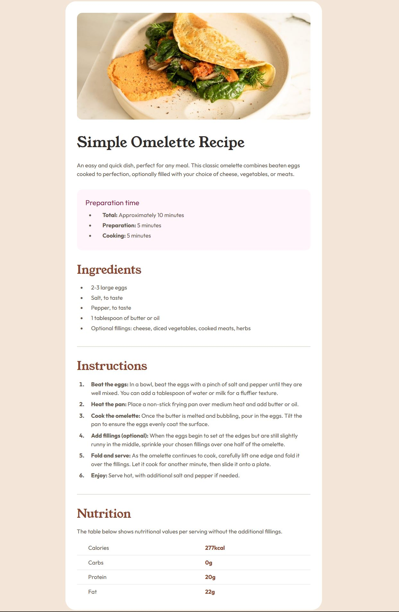

# Frontend Mentor - Recipe page solution

This is a solution to the [Recipe page challenge on Frontend Mentor](https://www.frontendmentor.io/challenges/recipe-page-KiTsR8QQKm). Frontend Mentor challenges help you improve your coding skills by building realistic projects. 

## Table of contents

- [Overview](#overview)
  - [Screenshot](#screenshot)
  - [Links](#links)
- [My process](#my-process)
  - [Built with](#built-with)
  - [What I learned](#what-i-learned)
  - [Useful resources](#useful-resources)
- [Author](#author)
- [Acknowledgments](#acknowledgments)

## Overview

### Screenshot



### Links

- Solution URL: [Git Hub Repo](https://github.com/Wolle3008/Omelette-Recipe-Page)
- Live Site URL: [Live view](https://wolle3008.github.io/Omelette-Recipe-Page/)

## My process

### Built with

- Semantic HTML5 markup
- CSS custom properties

### What I learned

When building this site I started using the whole content-area as only one container. Late into the project I realized it is problematic for the mobile solution, when only one part like the images should be full-width while the rest of the elements still has paddings/margins.
This made me realize I should probably separate future projects in a better way right from the start.
Second thing I learned was using table-tags in html so the nutrition part was semantic after all. First I tried the area with ```html <p>``` tags and with display of grid in css which made the borders easy for me to do.
After changing to a table in html I had to learn about the specific css for tables like border-collapse to make to nutrition page look like it should.
To see how you can add code snippets, see below:

### Useful resources

- [Guide for table borders](https://www.w3schools.com/css/css_table.asp) - This helped me to understand the border-collapse when using tables in HTML.

## Author

- Frontend Mentor - [@Wolle3008](https://www.frontendmentor.io/profile/Wolle3008)

## Acknowledgments

Best regards to my friend that reviewed my solution in the first place and gave good advice.
